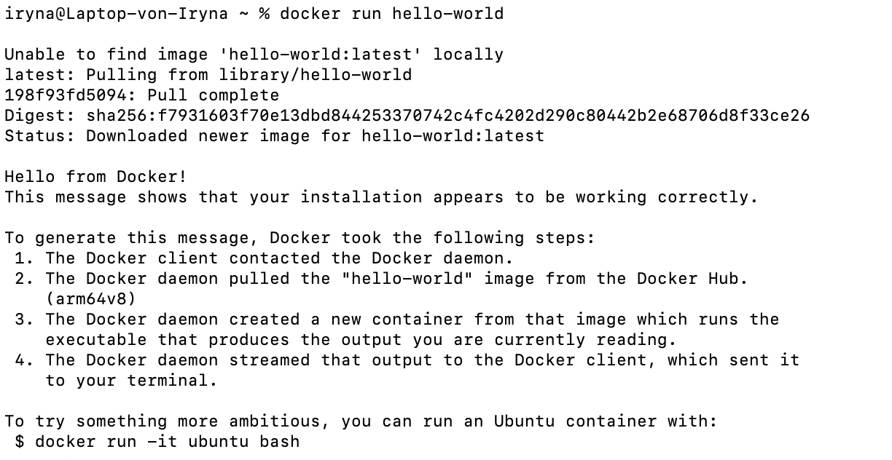
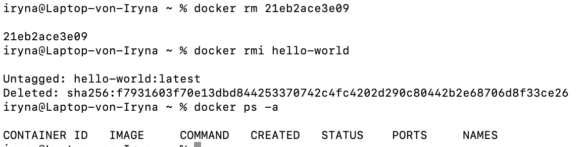
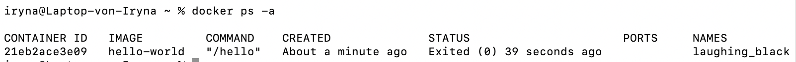

# docker Завдання 1

## - Запустити базовий контейнер:
docker run hello-world

### Результат

## - Перевірити список контейнерів:
docker ps -a

### Результат

## - Видалити контейнер і образ.
  Використані команди:
  
  docker rm 
  
  docker rmi hello-world

### Результат

